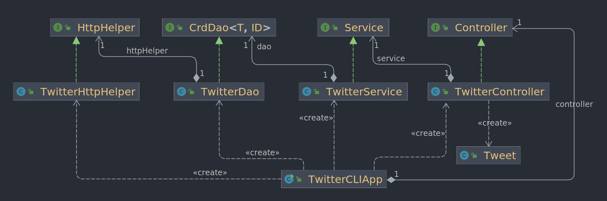

# Introduction
This is an application written in Java that enables the users to post, read, and delete a tweet through the command line interface. 

It was created to get the junior developers more familiar with core Java and REST API. 
Most importantly, Twitter REST API allowed us to communicate with Twitter so the users can post, read, or delete a tweet.
To better manage the project, improve performance, and building process, Maven was used.
Also, Docker was used to to pack, deploy, and run the application with the container.

As a branching model of this project, we use GitFlow, so we can achieve the best practice of continuous delivery.


# Quick Start
**Package the application**  
As this is a _Maven project_, `mvn clean package` is used to package the application.  

**Run the application**  
Our application was dockerized, and it's available on DockerHub. Follow the instructions to run the application.  
1. pull the image
    ```
    docker pull heesoolim/twitter:latest
    ```
2. check if the docker image is successfully pulled
    ```
    docker image ls | grep "twitter"
    ```
3. post, read, or delete a tweet
    - To post:
    ```
    docker run --rm \
    -e consumerKey=YOUR_VALUE \
    -e consumerSecret=YOUR_VALUE \
    -e accessToken=YOUR_VALUE \
    -e tokenSecret=YOUR_VALUE \
    heesoolim/twitter post "POST_TEXT" "LATITUDE:LONGITUDE"
    ```
    - To read:
    ```
    docker run --rm \
    -e consumerKey=YOUR_VALUE \
    -e consumerSecret=YOUR_VALUE \
    -e accessToken=YOUR_VALUE \
    -e tokenSecret=YOUR_VALUE \
    heesoolim/twitter show POST_ID [FIELDS_TO_DISPLAY]
    ```
   - To delete:
   ```
   docker run --rm \
   -e consumerKey=YOUR_VALUE \
   -e consumerSecret=YOUR_VALUE \
   -e accessToken=YOUR_VALUE \
   -e tokenSecret=YOUR_VALUE \
   heesoolim/twitter delete POST_ID
   ```

# Design
## UML diagram

- **Main App**  
`TwitterCLIAPP` class declares and instantiate all the components that are required, 
such as `TwitterHttpHelper`, `TwitterDao`, `TwitterService`, and 
`TwitterController`, and call run method that will
check the arguments to call the corresponding method.
- **Controller**  
`TwitterController` is a class that implements `Controller` interface. 
In controller, the user input (args) is processed and consumed to execute the 
service method. This class does not contain any code that is related to 
the business logic.
- **Service**
`TwitterService` is a class that implements the interface `Service`. 
This is a layer that deals with the business logic. For instance, this class
ensures that the length of the tweet text does not exceed 140 and ID format is
correct.
- **DAO**
`TwitterDao` class implements the interface `CrdDao`. Because the service layer
handles the business logic, this layer does not deal with it. This layer handles
the data that will be used for the REST API request.\
## Models
- **Tweet**  
When we handle the API request and response, we use `Tweet` model, which
is the same as a tweet object documented in 
[tweeter developer platform](https://developer.twitter.com/en/docs/twitter-api/v1/data-dictionary/object-model/tweet).
`Tweet` model includes following attributes: 
  
    | Type   |  Field   |
    |-----|-----|
    | String | CreatedAt |
    | long   | id |
    | String | idStr |
    | String | text |
    | Entities | entities |
    | Coordinates | coordinates |
    | int | retweetCount |
    | int | favoriteCount |
    | boolean | favorited |
    | boolean | retweeted |

Tweet model includes several objects such as Coordinates and Entities
- **Entities**  
This class provides metadata and additional contextual information 
about content posted on Twitter. Following is the attributes it contains:

  | Type        |  Field   |
  |-----|-----|
  | HashTag[] | hashtags |

- **Hashtag**  
  This class contains hashtag included in the Tweet body.
  `Hashtag` model includes following attributes:

  | Type        |  Field   |
  |-----|-----|
  | int[] | indices |
  | String | text |

## Spring
Because we have many classes involved in this application, such as models, 
controller, service, and data access layer, dependency management is complex. 
`TwitterCLIApp` (app class) depends on `TwitterController`,
the controller depends on `TwitterService`, the service depends on `TwitterDao`, and
Dao depends on `TwitterHttpHelper`.  

To better manage the dependencies, we are using Spring. For instance, we are using
`@Autowired` annotation so that the IoC container can inject the dependencies through
the constructor. Also, `@Service`, `@Controller`, `@Repository`, and `@component`
were used to let the IoC container know that the class is a Bean.

# Test
We have tested the application by using Junit and mockito. All the classes, such as
`TwitterController`,`TwitterDao`, and `TwitterService`, had been tested using 
`Junit` to see if each class works as expected with other classes that are included.
They also had been tested using `mockito` to see if individual units or components of 
the software (without dependencies) are running smoothly.

## Deployment
To deploy our application, we dockerized the application.  
We first created a `Dockerfile` that contains the instructions to
build Docker images. Then to package the application, we used maven command, 
which is `mvn clean package`. We built a local docker image using the command 
`docker build -t heesoolim/twitter .`. once the image is created, we pushed it
to the DockerHub with the command `docker push heesoolim/twitter`

# Improvements
- Add a feature to post multiple tweets with one command.
- Enable the users to find a tweet by text.
- Add a feature that allows the users to read all the tweets that belong to the user.